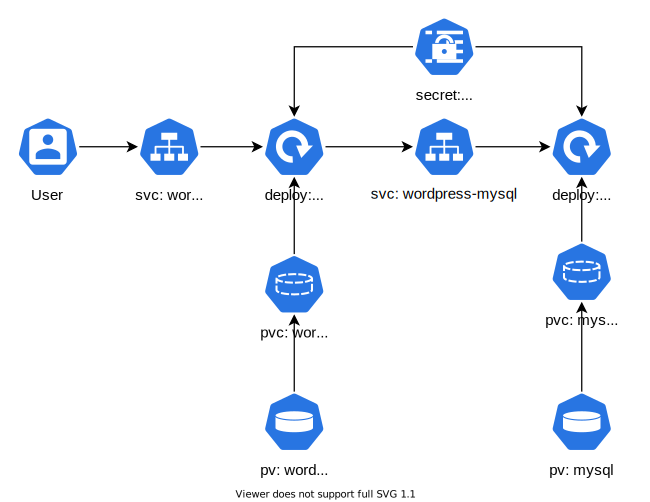

# Run Wordpress in Kubernetes

This repository contains all manifests required to deploy an instance of Wordpress in a Kubernetes cluster.

Based on repo: https://github.com/kodekloudhub/kubernetes-challenge-1-wordpress




## Installation
```
kubectl apply -f manifests/
```


## Persistent Volumes

The persistent volumes created for Wordpress and MySQL/MariaDB make use of `HostPath` volume type which is not recommended for multi-node clusters.


